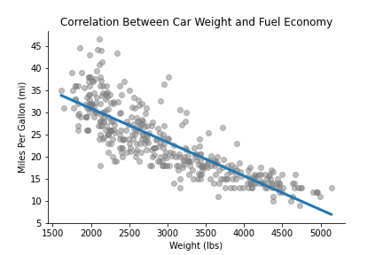

# Locally Weighted Regression
### DATA 441 Project #1 - Sam Joyner

### Linear Regression

Linear regression is a technique used to predict an output value given at least one input. Mathematically, this can be represented as:

<p align="center">
  <b>y</b> = <b>X&beta;</b>+<b>&epsilon;</b>
</p>

Where <b>y</b> is the vector of outputs, with <b>x</b> as the vector of inputs, <b>&beta;</b> as the weights vector, and <b>&epsilon;</b> as the random error for each prediction. An import assumption is that the error term is normally distributed with a mean of zero and standard deviation of one. With this assumption in hand, we can solve for <b>&beta;</b>: 

<p align="center">
  <b>X<sup>T</sup>y</b> = <b>X<sup>T</sup>X&beta;</b>+<b>X<sup>T</sup>&epsilon;</b> = <b>X<sup>T</sup>X&beta;</b>
  <br>
  <b>(X<sup>T</sup>X)<sup>-1</sup>X<sup>T</sup>y</b> = <b>&beta;</b>
</p>

Using this we can also plug <b>&beta;</b> back in to get a explicit formula for <b>y</b>, our predictions. As the name suggests, this technique works great for linear datasets. The following example shows the relationship between car weight and mileage, and the line in blue is a standard linear regression, done with the technqiue described above, that attempts to predict miles per gallon based off weight.

<p align="center">

</p>

Linear regression does an decent job, but there is certainly room to improve this model, particularly with lower weights where the trend appears more quadratic rather than linear.

### Adding Weights to the Regression Equation

To fit a better model to this data, we can employ <b>Locally Weighted Linear Regression (LOWESS)</b>, which is similar to the technique above, but allows for curvature by performing linear regression over very small portions of the data that collectively create a curved, better fit model. To do this, we now use a matrix of weights (more on this later) that determines how important values will be to the given prediction. To represent this mathematically, we begin with the same regression equation as before and then multiply by <b>W</b>, which is a matrix containing weights along the diagonal and zeros everywhere else: 

<p align="center">
  <b>Wy</b> = <b>WX&beta;</b>+<b>W&epsilon;</b>
  <br>
  <b>X<sup>T</sup>Wy</b> = <b>X<sup>T</sup>WX&beta;</b>+<b>X<sup>T</sup>&epsilon;</b> = <b>X<sup>T</sup>WX&beta;</b>
  <br>
  <b>(X<sup>T</sup>WX)<sup>-1</sup>X<sup>T</sup>Wy</b> = <b>&beta;</b>
</p>

This leads to a seemingly similar result, but as we will explore below these weights have major implications for the fitted model.

### Applying Weighted Linear Regression

The obvious question becomes how to determine the proper weights, and this is done through kernels that determine the weights and a hyperparameter that specifies the width of the kernel. All of the points that have a nonzero weight make up a neighborhood, and from each neighborhood a linear regression is made, and all of these collectively make up the nonlinear model. Examples of kernels include the Gaussian and Epanechnikov kernels, seen below.

<p align='center'>
  <b>Import kernel graphs </b>
</p>

Using these kernels to determine the weight matrix, we can now begin to compute models using the weighted linear regression approach. The code below shows how to run these sets of small linear regressions to make the overall model using the weighted approach.

<p align='center'>
  <b>Import code - original/scikitlearn </b>
</p>

```Python
import numpy as np
```

From this code we can obtain the following fitted model, using the same data as before.

<p align='center'>
  <b>Import plot/model </b>
</p>

Clearly, this model fits the data better than the standard linear regression model, and by adjusting our hyperparameters we can further test with and adapt the fit of the model to avoid over or underfitting. 
